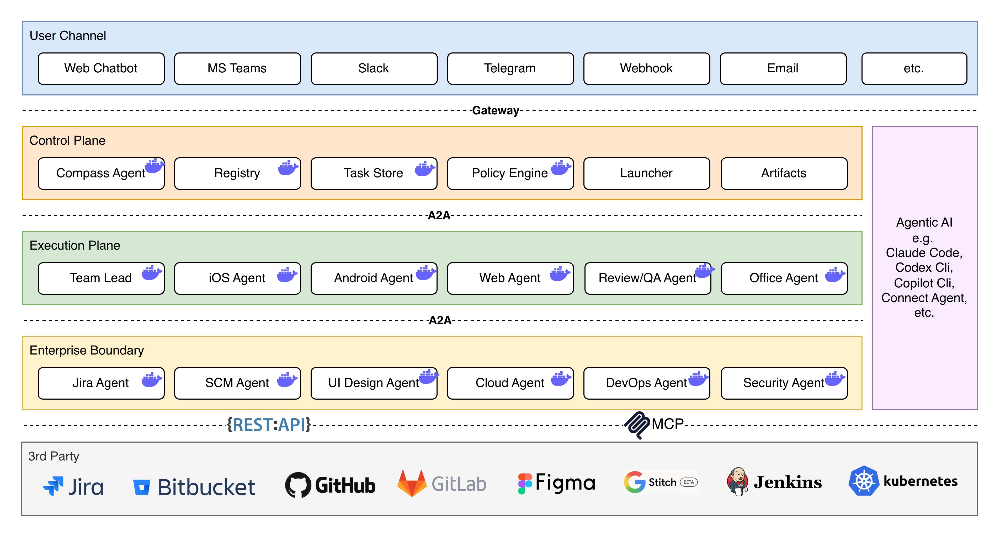
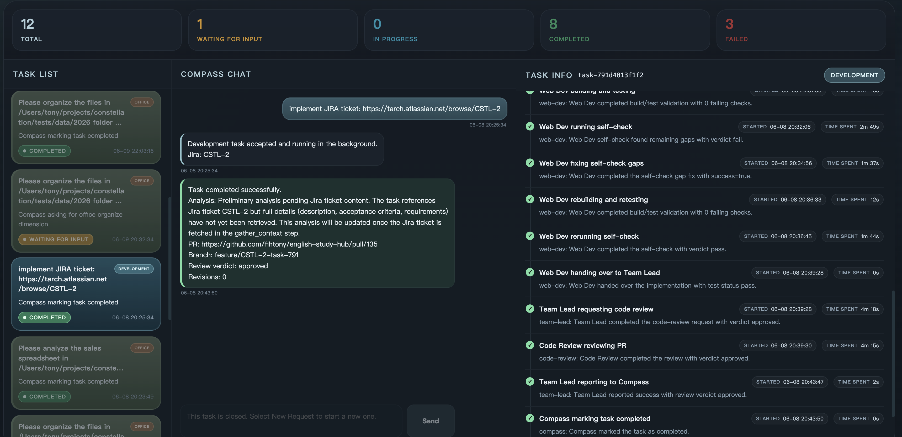
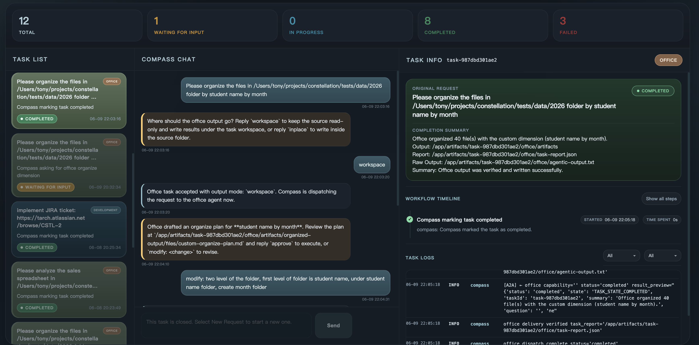

# Constellation

Constellation is a capability-driven multi-agent engineering system built on
the [A2A (Agent-to-Agent) protocol](https://google.github.io/A2A/). It uses a
"Graph outside, ReAct inside" architecture: durable workflow graphs coordinate
the macro lifecycle, while bounded agentic runtime calls handle open-ended
reasoning inside individual steps. Compass is the user-facing control plane,
Team Lead plans and reviews development work, and specialized boundary agents
own external integrations behind the same task contract.

Instead of wiring agents together with fixed service URLs, Constellation routes
work through the Capability Registry. Agents publish what they can do, parents
resolve capabilities at dispatch time, and missing capabilities fail closed.
Each child task receives a narrowed execution contract so the agent only gets
the tools, launch rights, and credentials required for that workflow.

## Highlights

- Capability-first routing: every inter-agent handoff resolves through the
  registry before dispatch.
- Graph outside, ReAct inside: workflow nodes stay auditable while agentic
  reasoning remains available where it adds value.
- Runtime-neutral execution: `claude-code`, `copilot-cli`, `codex-cli`, and
  `connect-agent` share the same `run()` / `run_agentic()` adapter contract.
- Least-privilege task execution: permission profiles, execution contracts,
  command policies, and tool allowlists constrain each agent step.
- Elastic task agents: persistent boundary services stay online, while Office,
  Web Dev, and Code Review launch on demand.
- Review-driven delivery: Team Lead plans the work, dispatches execution,
  reviews downstream output, and can drive remediation cycles.
- Resumable and auditable workflows: shared workspaces, major-step progress,
  callbacks, command logs, and validation records preserve long-running state.

## Architecture



```text
Browser / API client
    -> Compass Agent (control plane, UI, :8000)
         -> Office Agent (on demand, :8060)
         -> Team Lead Agent (planning, coordination, review, :8030)
              -> Capability Registry (:9000)
              -> Jira Agent (:8010)
              -> SCM Agent (:8020)
              -> UI Design Agent (:8040)
              -> Web Dev Agent (on demand, :8050)
              -> Code Review Agent (on demand, :8060)
```

## Compass UI

Compass is the user-facing control plane. Development and office requests are
submitted, monitored, resumed, and reviewed from the same console.

### Development task



A Jira implementation request is submitted from the chat panel. Compass routes
it to Team Lead, Team Lead gathers context and creates a delivery plan, and Web
Dev performs the implementation through its bounded agentic workflow. The task
timeline shows planning, implementation, tests, self-checks, code review,
remediation, and final reporting as major steps.

### Office folder organization task



Office requests route directly to the Office Agent. Compass collects the output
mode (`workspace` or `inplace`), the Office Agent drafts a plan, the user can
approve or revise it, and the final summary reports the generated deliverables,
output paths, and live task logs.

## Quick Start

Use Python 3.12 for local development.

```bash
# 1. Create a local development environment
python3.12 -m venv .venv
source .venv/bin/activate
pip install -e ".[dev]"

# 2. Configure shared runtime settings and boundary-agent credentials
cp config/.env.example config/.env
cp agents/jira/.env.example agents/jira/.env
cp agents/scm/.env.example agents/scm/.env
cp agents/ui_design/.env.example agents/ui_design/.env

# 3. Build and start the Docker stack
./start.sh docker build run

# 4. Open Compass
open http://localhost:8000/ui
```

For later Docker runs, `./start.sh docker` starts the existing images without a
rebuild. Rancher Desktop uses the same stack with a minimal socket-permission
override:

```bash
./start.sh rancher build run
```

The compose stack includes an `init-register` service that registers the agent
definitions with the Capability Registry. If you run services manually, refresh
the registry with:

```bash
python scripts/register_agents.py --registry-url http://localhost:9000
```

Useful health checks:

```bash
curl http://localhost:8000/health   # Compass
curl http://localhost:8030/health   # Team Lead
curl http://localhost:9000/health   # Capability Registry
```

## Agents

| Agent | Directory | Port | Mode | Role |
|-------|-----------|------|------|------|
| Compass | `agents/compass/` | 8000 | persistent | Control plane, Web UI, request routing |
| Team Lead | `agents/team_lead/` | 8030 | persistent | Planning, coordination, review, dispatch |
| Registry | `registry/` | 9000 | persistent | Capability definitions and live instance tracking |
| Jira | `agents/jira/` | 8010 | persistent | Jira REST/MCP boundary |
| SCM | `agents/scm/` | 8020 | persistent | GitHub and Bitbucket boundary |
| UI Design | `agents/ui_design/` | 8040 | persistent | Figma and Stitch design context boundary |
| Office | `agents/office/` | 8060 | on demand | Document summarization, data analysis, folder organization |
| Web Dev | `agents/web_dev/` | 8050 | on demand | Development implementation workflow |
| Code Review | `agents/code_review/` | 8060 | on demand | Independent code review workflow |

## Configuration

Configuration is layered from `config/constellation.yaml`, per-agent
`config.yaml` files, environment variables, and runtime overrides. Shared
deployment selectors belong in `config/.env`; agent-specific credentials stay
in the matching `agents/<agent>/.env` file.

| Variable | Location | Description |
|----------|----------|-------------|
| `AGENT_RUNTIME` | `config/.env` | Agentic backend: `claude-code`, `copilot-cli`, `codex-cli`, or `connect-agent` |
| `AGENT_MODEL` | `config/.env` | Generic model fallback when the active runtime has no dedicated model |
| `ANTHROPIC_AUTH_TOKEN` | `config/.env` | Claude Code runtime credential |
| `COPILOT_PROVIDER_BASE_URL` / `COPILOT_MODEL` | `config/.env` | Copilot CLI BYOK endpoint and model |
| `COPILOT_PROVIDER_API_KEY` | `config/.env` | Optional Copilot CLI BYOK provider key |
| `JIRA_BACKEND` | `config/.env` | Jira backend selector: `mcp` or `rest` |
| `SCM_BACKEND` | `config/.env` | SCM backend selector: `bitbucket`, `github-rest`, or `github-mcp` |
| `UI_DESIGN_DEFAULT_PROVIDER` | `config/.env` | Design provider selector: `stitch` or `figma` |
| `CONTAINER_RUNTIME` | `config/.env` | Container runtime: `docker` or `rancher` |
| `TZ` | `config/.env` | Deployment timezone for agent logs and timestamps |
| `JIRA_BASE_URL`, `JIRA_TOKEN`, `JIRA_EMAIL` | `agents/jira/.env` | Jira credentials |
| `SCM_BASE_URL`, `SCM_TOKEN` | `agents/scm/.env` | GitHub or Bitbucket credentials |
| `FIGMA_TOKEN`, `STITCH_API_KEY` | `agents/ui_design/.env` | Design-provider credentials |

## Build Layout

`scripts/build_base.sh` builds the shared base images used by every per-agent
Dockerfile:

- `constellation-base:agentic-<runtime>` includes Python dependencies, Node,
  the selected agentic CLI, and the shared framework.
- `constellation-base:boundary` is a slimmer image for Jira, SCM, and UI Design
  because those agents do not run local LLM calls.

`start.sh` builds the correct base image first, then builds persistent services
and the on-demand task-agent images (`office`, `web-dev`, and `code-review`).

## Running Tests

```bash
# Run all unit tests
pytest tests/unit/

# Run one unit test file
pytest tests/unit/framework/test_workflow.py

# Run one test by name
pytest tests/unit/framework/test_workflow.py::TestWorkflowBasic::test_linear_workflow

# Run integration tests that require live services
pytest tests/integration/ -m live

# Run end-to-end tests
pytest tests/e2e/
```

Test credentials belong in `tests/.env` when live integrations are required.
Generated test output and workspace files should stay under `artifacts/`.

## License

MIT (c) Tony Xu

