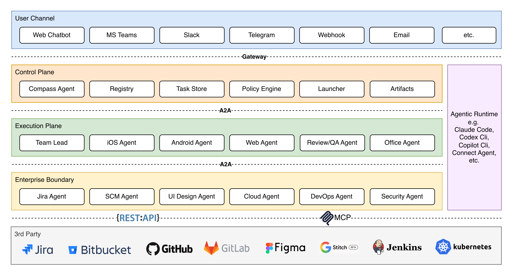

# Constellation

Constellation is a capability-driven multi-agent engineering system built on the [A2A (Agent-to-Agent) protocol](https://google.github.io/A2A/). Instead of collapsing routing, planning, integration, and execution into one service, it runs as a live agent topology where new skills can register at runtime, be discovered without restarting the platform, and scale independently. Compass serves as the control plane, Team Lead handles analysis, planning, and review, and specialized agents own external integrations or execution domains behind the same task contract. For each request, Constellation can choose a different workflow, inject task-specific instructions into the execution agent, and grant only the permissions that workflow requires. The result is an architecture built for real engineering work: parallel task handling, on-demand agent launch, resumable human-in-the-loop flows, shared workspaces, async callbacks, and a clean boundary between orchestration and delivery that is designed to grow with the system.

## Highlights

- Live capability discovery: agents register skills through the registry, and the runtime refreshes topology as new capabilities appear.
- Elastic execution model: persistent boundary agents stay available for integrations, while per-task execution agents launch only when work actually arrives.
- Workflow-aware dispatch: each request can follow a different path, with task-specific workflow instructions injected into the execution agent at runtime.
- Least-privilege operation: agent dispatch and execution are shaped by role checks, tool restrictions, and launch-time isolation controls.
- Parallel and multi-task ready: independent tasks can be routed, launched, and tracked concurrently without forcing a single shared worker model.
- Review-driven delivery: Team Lead gathers context, plans the work, reviews downstream output, and can drive revision cycles before completion.
- Resumable and auditable: shared workspaces, progress events, callbacks, command logs, and stage summaries preserve continuity across long-running jobs.

## Architecture



```
Browser / API client
    └─► Compass Agent (control plane, UI, :8080)
             ├─► Office Agent (:8060)         — local document tasks
             └─► Team Lead Agent (:8030)      — planning, coordination, review
                      ├─► Capability Registry (:9000)
                      ├─► Jira Agent (:8010)       — Jira integration
                      ├─► SCM Agent (:8020)        — GitHub / Bitbucket integration
                      ├─► UI Design Agent (:8040)  — Figma + Stitch design context
                      └─► Execution Agents         — Android / Web / future iOS
```

## Quick Start

```bash
# 1. Copy and fill in environment files for each agent
cp compass/.env.example   compass/.env
cp jira/.env.example      jira/.env
cp scm/.env.example       scm/.env
cp ui-design/.env.example ui-design/.env

# 2. Build on-demand agent images
./build-agents.sh

# 3. Start all persistent services
docker compose up --build -d

# 4. Open the Web UI
open http://localhost:8080
```

## Agents

| Agent | Directory | Port | Role |
|-------|-----------|------|------|
| Compass | `compass/` | 8080 | Control plane, Web UI, user-facing routing |
| Team Lead | `team-lead/` | 8030 | Planning, coordination, review, and agent dispatch |
| Registry | `registry/` | 9000 | Capability discovery and instance tracking |
| Jira Agent | `jira/` | 8010 | Jira integration |
| SCM | `scm/` | 8020 | Source control integration |
| UI Design | `ui-design/` | 8040 | Design context from Figma and Stitch |
| Office | `office/` | 8060 | Local office and document workflows |
| Android | `android/` | on-demand | Task execution agent |
| Web | `web/` | on-demand | Task execution agent |

## Configuration

Each agent reads from its own `.env` file. Copy the corresponding `.env.example` and fill in credentials. Key variables:

| Variable | Description |
|----------|-------------|
| `OPENAI_BASE_URL` | OpenAI-compatible LLM endpoint |
| `OPENAI_MODEL` | Model name |
| `JIRA_TOKEN` | Jira API token |
| `JIRA_EMAIL` | Jira account email (Basic auth) |
| `SCM_TOKEN` | GitHub / Bitbucket personal access token |
| `FIGMA_TOKEN` | Figma personal access token |
| `STITCH_API_KEY` | Google Stitch / Gemini API key |

## Running Tests

```bash
# Jira MCP integration tests
python3 tests/test_mcp.py --integration --jira

# UI Design agent tests (Figma + Stitch)
python3 tests/test_ui_design_agent.py --integration

# Async skill contract tests (SCM clone + Android callback)
python3 tests/test_async_skills.py --container

# End-to-end workflow tests
python3 tests/test_e2e.py
```

Set test credentials in `tests/.env` (copy from `tests/.env.example`).

## License

MIT © Tony Xu


